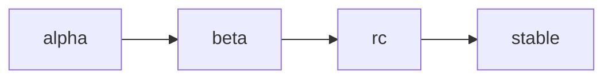

# Public Versions

VTubers.TV uses a custom theme-based versioning system for public releases. This document explains how public versions work and how they map to internal semantic versions.

## Public Version Format

A public version has the following format:

```
THEME-VERSION[-STATUS]
```

Where:
- `THEME`: An approved theme name (e.g., 'Aurora', 'Nebula')
- `VERSION`: A simplified version number (e.g., '1.0', '2.1')
- `STATUS`: Optional status indicator ('alpha', 'beta', 'rc')

### Regular Expression

The package validates public versions using this regular expression:

```typescript
/^([A-Z][a-zA-Z]+)-(\d+\.\d+)(?:-(alpha|beta|rc))?$/
```

This regex ensures:
1. Theme starts with a capital letter
2. Version is in X.Y format
3. Status is one of the approved values

## Themes

### Approved Themes

The package maintains a list of approved themes:

```typescript
const approvedThemes = [
  'Aurora',
  'Nebula'
  // More themes can be added
];
```

### Adding New Themes

Themes can be added to the approved list:

```typescript
SemVer.approvedThemes.push('Celestial');
```

### Theme Guidelines

1. Must start with a capital letter
2. Should be celestial or nature-inspired
3. Should be memorable and distinctive
4. Should not conflict with existing themes

## Version Status

### Status Levels

1. **alpha**: Early development
   ```typescript
   'Aurora-1.0-alpha'
   ```

2. **beta**: Feature complete, testing
   ```typescript
   'Aurora-1.0-beta'
   ```

3. **rc**: Release candidate
   ```typescript
   'Aurora-1.0-rc'
   ```

4. **stable**: (default, no suffix)
   ```typescript
   'Aurora-1.0'
   ```

### Status Progression



## Version Mapping

### Internal to Public Mapping

Public versions map to internal semantic versions:

```typescript
const mapping = SemVer.createVersionMapping(
  '1.2.3',        // Internal version
  'Aurora-1.0',   // Public version
  '2024-03-20'    // Release date
);
```

### Version Data

Additional metadata can be associated with versions:

```typescript
interface PublicVersionData {
  internalVersion: string;
  publicVersion: string;
  releaseDate: string;
  theme: {
    name: string;
    description: string;
    color: string;
    inspiration?: string;
  };
  status: 'alpha' | 'beta' | 'rc' | 'stable' | 'deprecated';
  deprecationDate?: string;
  securityUpdates: boolean;
}
```

### Querying Version Data

```typescript
// Get data for a specific version
const data = SemVer.getVersionData('Aurora-1.0');

// Get latest stable version
const latest = SemVer.getLatestStableVersion();

// Get all versions with a specific status
const betaVersions = SemVer.getVersionsByStatus('beta');
```

## Examples

### Basic Usage

```typescript
// Parse a public version
const version = SemVer.parsePublicVersion('Aurora-1.0-beta');
console.log(version);
// {
//   theme: 'Aurora',
//   version: '1.0',
//   status: 'beta'
// }

// Validate a public version
console.log(SemVer.isValidPublicVersion('Aurora-1.0')); // true
console.log(SemVer.isValidPublicVersion('Invalid-1.0')); // false
```

### Version Mapping

```typescript
// Create a version mapping
const mapping = SemVer.createVersionMapping(
  '1.2.3',
  'Aurora-1.0',
  '2024-03-20'
);

// Get version data
const data = SemVer.getVersionData('Aurora-1.0');
if (data) {
  console.log(`Internal version: ${data.internalVersion}`);
  console.log(`Theme: ${data.theme.name}`);
  console.log(`Status: ${data.status}`);
}
```

## Error Handling

```typescript
try {
  SemVer.parsePublicVersion('InvalidTheme-1.0');
} catch (error) {
  console.error('Invalid theme name');
}

try {
  SemVer.parsePublicVersion('Aurora-1.0-gamma');
} catch (error) {
  console.error('Invalid status');
}
```

## Best Practices

1. **Theme Selection**
   - Choose themes that reflect major releases
   - Keep themes consistent within major versions
   - Document theme meanings and inspirations

2. **Version Mapping**
   - Maintain clear mapping documentation
   - Keep internal versions hidden from users
   - Use public versions in user-facing contexts

3. **Status Management**
   - Follow the status progression
   - Document status transitions
   - Communicate status changes to users

4. **Version Data**
   - Keep version metadata up to date
   - Include deprecation dates when known
   - Document security update policies

## See Also

- [Version Parsing](./version-parsing.md) - Standard SemVer parsing
- [Version Comparison](./version-comparison.md) - Version comparison rules
- [Version Mapping](./version-mapping.md) - Detailed mapping documentation
- [API Reference](./api-reference.md) - Complete API documentation 