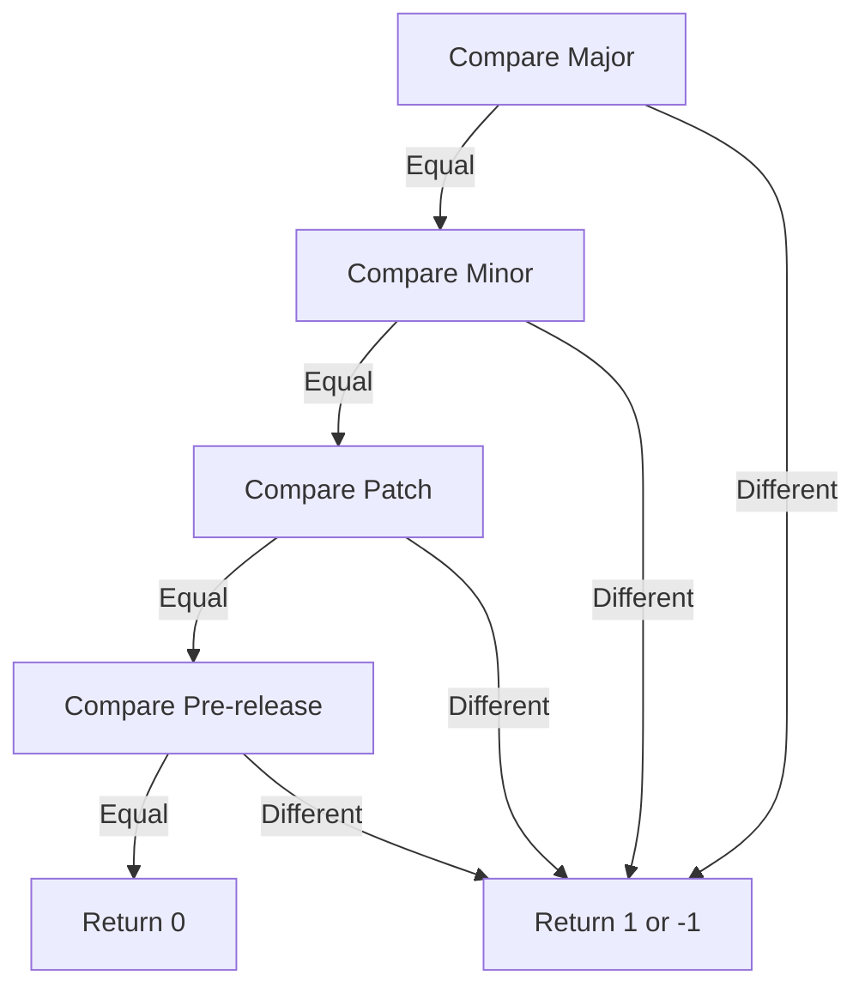

# Version Comparison

This document explains how version comparison works in the @vtubers.tv/semver package, following the SemVer 2.0.0 specification.

## Comparison Rules

### Basic Rules

1. Versions are compared by precedence: `major.minor.patch`
2. Pre-release versions have lower precedence than normal versions
3. Build metadata DOES NOT affect precedence

### Return Values

The `compare(v1: string, v2: string)` function returns:
- `1` if v1 > v2
- `0` if v1 = v2
- `-1` if v1 < v2

## Precedence Order

1. Major version number
2. Minor version number
3. Patch version number
4. Pre-release identifiers
5. Build metadata (ignored for comparison)



## Examples

### Basic Comparison

```typescript
// Major version comparison
SemVer.compare('2.0.0', '1.9.9') // 1
SemVer.compare('1.0.0', '2.0.0') // -1

// Minor version comparison
SemVer.compare('1.2.0', '1.1.9') // 1
SemVer.compare('1.1.0', '1.2.0') // -1

// Patch version comparison
SemVer.compare('1.1.2', '1.1.1') // 1
SemVer.compare('1.1.1', '1.1.2') // -1

// Equal versions
SemVer.compare('1.1.0', '1.1.0') // 0
```

### Pre-release Comparison

Pre-release versions have lower precedence than normal versions:

```typescript
// Normal vs pre-release
SemVer.compare('1.0.0', '1.0.0-alpha') // 1
SemVer.compare('1.0.0-alpha', '1.0.0') // -1

// Pre-release identifiers
SemVer.compare('1.0.0-alpha', '1.0.0-beta') // -1
SemVer.compare('1.0.0-alpha.1', '1.0.0-alpha.2') // -1
SemVer.compare('1.0.0-alpha.beta', '1.0.0-beta.alpha') // -1
```

### Build Metadata

Build metadata is ignored in version comparison:

```typescript
// Build metadata is ignored
SemVer.compare('1.0.0+build.1', '1.0.0+build.2') // 0
SemVer.compare('1.0.0-alpha+build.1', '1.0.0-alpha+build.2') // 0
```

## Pre-release Precedence Rules

When comparing pre-release versions:

1. Identifiers are compared numerically if both are numbers
2. Identifiers are compared ASCII lexically if both are strings
3. Numeric identifiers have lower precedence than string identifiers
4. A larger set of pre-release fields has higher precedence

```typescript
// Numeric comparison
SemVer.compare('1.0.0-1', '1.0.0-2') // -1
SemVer.compare('1.0.0-2', '1.0.0-1') // 1

// String comparison
SemVer.compare('1.0.0-alpha', '1.0.0-beta') // -1
SemVer.compare('1.0.0-beta', '1.0.0-alpha') // 1

// Mixed comparison
SemVer.compare('1.0.0-1', '1.0.0-alpha') // -1
SemVer.compare('1.0.0-alpha', '1.0.0-1') // 1

// Length comparison
SemVer.compare('1.0.0-alpha', '1.0.0-alpha.1') // -1
SemVer.compare('1.0.0-alpha.1', '1.0.0-alpha') // 1
```

## Implementation Details

The comparison algorithm follows these steps:

```typescript
function compare(v1: string, v2: string): number {
  const ver1 = parse(v1);
  const ver2 = parse(v2);

  // Compare major.minor.patch
  if (ver1.major !== ver2.major) return ver1.major > ver2.major ? 1 : -1;
  if (ver1.minor !== ver2.minor) return ver1.minor > ver2.minor ? 1 : -1;
  if (ver1.patch !== ver2.patch) return ver1.patch > ver2.patch ? 1 : -1;

  // Compare pre-release
  if (!ver1.prerelease && !ver2.prerelease) return 0;
  if (!ver1.prerelease) return 1;
  if (!ver2.prerelease) return -1;

  // Compare pre-release identifiers
  const minLength = Math.min(ver1.prerelease.length, ver2.prerelease.length);
  for (let i = 0; i < minLength; i++) {
    const a = ver1.prerelease[i];
    const b = ver2.prerelease[i];
    
    const aNum = parseInt(a);
    const bNum = parseInt(b);
    
    if (isNaN(aNum) && isNaN(bNum)) {
      if (a > b) return 1;
      if (a < b) return -1;
      continue;
    }
    
    if (isNaN(aNum)) return 1;
    if (isNaN(bNum)) return -1;
    if (aNum > bNum) return 1;
    if (aNum < bNum) return -1;
  }

  return ver1.prerelease.length - ver2.prerelease.length;
}
```

## Best Practices

1. **Use the Compare Function**
   ```typescript
   // Good
   if (SemVer.compare(v1, v2) > 0) {
     // v1 is greater
   }

   // Bad
   if (v1 > v2) {
     // String comparison doesn't work for versions
   }
   ```

2. **Handle Pre-release Versions**
   ```typescript
   const version = SemVer.parse(v);
   if (version.prerelease) {
     // Handle pre-release version differently
   }
   ```

3. **Ignore Build Metadata**
   ```typescript
   // These are equivalent for comparison
   const v1 = '1.0.0+build.1';
   const v2 = '1.0.0+build.2';
   console.assert(SemVer.compare(v1, v2) === 0);
   ```

4. **Validate Before Comparing**
   ```typescript
   if (SemVer.isValid(v1) && SemVer.isValid(v2)) {
     const result = SemVer.compare(v1, v2);
     // Use comparison result
   }
   ```

## See Also

- [Version Parsing](./version-parsing.md) - How versions are parsed
- [Public Versions](./public-versions.md) - VTubers.TV public version format
- [API Reference](./api-reference.md) - Complete API documentation 