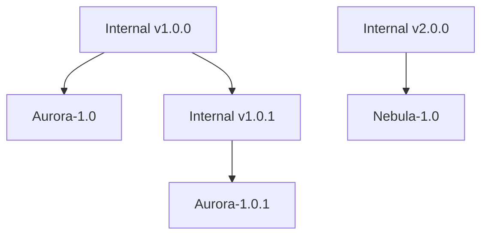
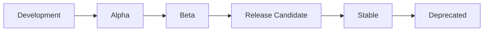

# Version Mapping

This document explains how VTubers.TV maps between internal semantic versions and public theme-based versions.

## Overview

VTubers.TV uses two versioning systems:
1. Internal: Standard SemVer (e.g., `1.2.3-beta.1`)
2. Public: Theme-based (e.g., `Aurora-1.0-beta`)

The version mapping system provides:
- Clear mapping between internal and public versions
- Rich metadata for each version
- Version history tracking
- Status management
- Release notes and feature flags

## Version Mapping Structure

### Basic Mapping

```typescript
interface VersionMapping {
  internalVersion: string;  // SemVer format
  publicVersion: string;    // Theme-based format
  releaseDate: string;      // ISO 8601 date
  theme: string;           // Theme name
  status: string;          // Version status
}
```

### Extended Version Data

```typescript
interface PublicVersionData {
  internalVersion: string;
  publicVersion: string;
  releaseDate: string;
  theme: {
    name: string;
    description: string;
    color: string;
    inspiration?: string;
  };
  status: 'alpha' | 'beta' | 'rc' | 'stable' | 'deprecated';
  deprecationDate?: string;
  securityUpdates: boolean;
}
```

### Feature Flags

```typescript
interface FeatureFlag {
  name: string;
  description: string;
  enabled: boolean;
  rolloutPercentage?: number;
  requirements?: string[];
}
```

### Release Notes

```typescript
interface ReleaseNote {
  type: 'feature' | 'enhancement' | 'bugfix' | 'security' | 'breaking';
  title: string;
  description: string;
  issueId?: string;
  prId?: string;
}
```

## Creating Version Mappings

### Basic Mapping

```typescript
const mapping = SemVer.createVersionMapping(
  '1.2.3',        // Internal version
  'Aurora-1.0',   // Public version
  '2024-03-20'    // Release date
);
```

### With Extended Data

```typescript
const versionData: PublicVersionData = {
  internalVersion: '1.2.3',
  publicVersion: 'Aurora-1.0',
  releaseDate: '2024-03-20',
  theme: {
    name: 'Aurora',
    description: 'The first version of VTubersTV',
    color: '#7B68EE',
    inspiration: 'Northern Lights'
  },
  status: 'stable',
  securityUpdates: true
};
```

## Version History Management



### Querying Version History

```typescript
// Get specific version data
const data = SemVer.getVersionData('Aurora-1.0');

// Get latest stable version
const latest = SemVer.getLatestStableVersion();

// Get versions by status
const betaVersions = SemVer.getVersionsByStatus('beta');

// Get version by internal version
const data = SemVer.getVersionByInternal('1.2.3');
```

## Version Status Lifecycle



### Status Management

```typescript
// Version progression example
const versions = [
  {
    internalVersion: '1.2.3-alpha.1',
    publicVersion: 'Aurora-1.0-alpha',
    status: 'alpha'
  },
  {
    internalVersion: '1.2.3-beta.1',
    publicVersion: 'Aurora-1.0-beta',
    status: 'beta'
  },
  {
    internalVersion: '1.2.3-rc.1',
    publicVersion: 'Aurora-1.0-rc',
    status: 'rc'
  },
  {
    internalVersion: '1.2.3',
    publicVersion: 'Aurora-1.0',
    status: 'stable'
  }
];
```

## Feature Management

### Feature Flags

```typescript
const featureFlags: FeatureFlag[] = [
  {
    name: 'newUI',
    description: 'New user interface components',
    enabled: true,
    rolloutPercentage: 50,
    requirements: ['Aurora-1.0-beta']
  }
];
```

### Release Notes

```typescript
const releaseNotes: ReleaseNote[] = [
  {
    type: 'feature',
    title: 'New Streaming Interface',
    description: 'Completely redesigned streaming interface',
    issueId: 'VTUBE-123',
    prId: 'PR-456'
  }
];
```

## Version Metrics

```typescript
interface VersionMetrics {
  performanceScore?: number;
  stabilityScore?: number;
  userSatisfaction?: number;
  activeUsers?: number;
  averageStreamDuration?: number;
}
```

## Best Practices

### Version Mapping

1. **Clear Mapping Documentation**
   ```typescript
   // Document mapping rationale
   const mapping = SemVer.createVersionMapping(
     '1.2.3',      // Bug fixes and minor improvements
     'Aurora-1.0', // First stable release
     '2024-03-20'
   );
   ```

2. **Theme Consistency**
   ```typescript
   // Keep theme for minor versions
   'Aurora-1.0'    // Initial release
   'Aurora-1.1'    // Feature update
   'Aurora-1.2'    // Enhancement
   'Nebula-2.0'    // Major new version, new theme
   ```

3. **Status Transitions**
   ```typescript
   // Document status changes
   const statusHistory = [
     { date: '2024-01-01', status: 'alpha' },
     { date: '2024-02-01', status: 'beta' },
     { date: '2024-03-01', status: 'rc' },
     { date: '2024-03-20', status: 'stable' }
   ];
   ```

### Version Data Management

1. **Complete Metadata**
   ```typescript
   const versionData = {
     // ... version info ...
     theme: {
       name: 'Aurora',
       description: 'Clear and detailed description',
       color: '#7B68EE',
       inspiration: 'Document inspiration'
     }
   };
   ```

2. **Feature Documentation**
   ```typescript
   const features = {
     name: 'newUI',
     description: 'Detailed description of the feature',
     requirements: [
       'Minimum version requirements',
       'Dependencies',
       'Hardware requirements'
     ]
   };
   ```

3. **Security Updates**
   ```typescript
   const versionSupport = {
     version: 'Aurora-1.0',
     securityUpdates: true,
     endOfLife: '2025-03-20'
   };
   ```

## See Also

- [Public Versions](./public-versions.md) - Public version format details
- [Version Comparison](./version-comparison.md) - Version comparison rules
- [API Reference](./api-reference.md) - Complete API documentation 